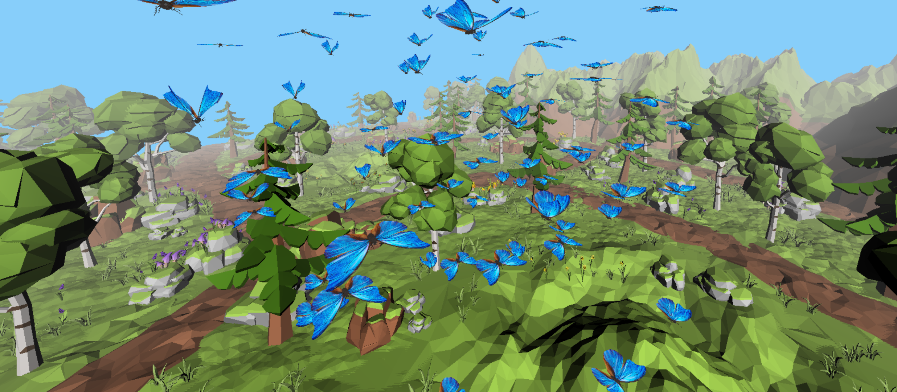
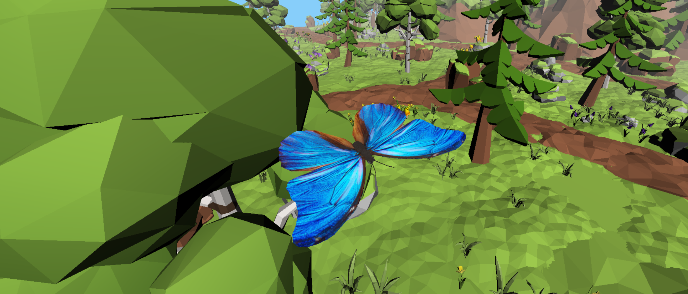

Butterfly Simulation with WebGPU
==================================
### University of Pennsylvania, CIS 565: GPU Programming and Architecture, Final Project
#### Author:   
* [Jiajun Li](https://www.linkedin.com/in/jiajun-li-5063a4217/) 
* [Haoquan Liang](https://www.linkedin.com/in/leohaoquanliang/)
* [Shineng Tang](https://www.linkedin.com/in/shineng-t-224192195/)

## **Overview**
Our project aims to create a simulation of butterflies and control their behaviors using WebGPU. We created a hierarchical rigged skeleton for the butterfy, animated the butterflies by using the bones, and used instancing to increase the performance so that it can run in realtime.

    

## Table of Contents  
* [Presentations](#presentation)
* [Features](#features) 
* [Future Improvements](#future)
* [Reference](#reference)
* [Blooper](#blooper)

## <a name="presentation">Presentations</a>
* [**Final Presentation - 12/12/22**](https://docs.google.com/presentation/d/17RwpunRFOpwLk0Y-TTjAFLTOdtHMy-Pt/edit?usp=sharing&ouid=108273071647581215041&rtpof=true&sd=true)
* [Milestone 3 - 12/05/22](https://docs.google.com/presentation/d/1AHIefwlu55ZyYZG1VEadliJOUGMHE7-N/edit#slide=id.g19cb66c9ca1_0_15)
* [Milestone 2 - 11/28/22](https://docs.google.com/presentation/d/1AHIefwlu55ZyYZG1VEadliJOUGMHE7-N/edit?rtpof=true)
* [Milestone 1 - 11/16/22](https://docs.google.com/presentation/d/1D0KU-Wp5UGeHj1HUCtebzcEjDT0gydEKm9OTPFgEmzs/edit#slide=id.g18fde25b9ae_9_0)
* [Pitch - 11/6/22](https://docs.google.com/presentation/d/1jvJxEsBRErgb7ftC49tvywUgjpmYqgujXNGTN85En-0/edit?usp=sharing)

## <a name="features">Features</a>
### Visual Features
- **Robust glTF Loader with Texture, Material, and Joints Loading and PRB Shading**
  - Loading glTF files with skeleton information and PBR-based materials
  - Support loading multiple glTF meshes.  
  - Very robust, if a glTF file is missing a certain object like BaseColor Texture, we can still handle it. 
- **Procedural Butterfly Color**
  - Procedurally change the color for each newly instanced butterfly 
- **Control GUI**
  - We created a UI that allows the user to change many key parameters for the simulation, such as the number of the butterflies, behaviors, and colors so that the user can easily see the visual effects of different scenes easily. 
- **Distance Fog**
  - Using distance-based fog to hide the boundary of the scene
### Technical Features
- **WebGPU Compute and Rendering Pipeline**
  - Compute shaders compute the new joint transformations and deform the butterfly mesh accordingly
  - The pipeline makes adding more parameters to the simulation very easy
- **Instanced Rendering with Animations**
  - Instancing rendering ensures minimum memory consumption and maximum rendering performance 
  - Instancing with varying animations and behaviors for each instance/ 
- **Hierachy Skeleton Loader and Mesh Deformer**
  - We rigged the butterfly mesh with Blender and successfully use our pipeline and the skeleton to deform the mesh.
  - Joint hierachy is correctly maintained and used in computation. A novel algorithm is used to solve the problem that there is no recursion in the shaders.   
### Simulation Features
- **Butterfly Simulations**
  - Currently we have simple procedurally generated path and simple forces like gravity and wind for the butterfly
- **Behavior Controls**
  -  Seek: all the butterflies will seek a position and gather there.
  -  Departure: all the butterflies will go to the opposite position of the target position.
  -  Wander: the butterflies will wander around in the space

## <a name="future">Future Improvements</a>
We enjoyed this project and we are planning on improve this project by adding more features and improving the performances.   
Here are a few things we want to add:
* Add more behaviors, such as collision avoidance, lead, and cohesion. 
* Add more options to the UI, such as switching different scenes. 
* Add more procedural options, such as more patterns for the butterfly wings and more shapes
* Add a physically-based aerodynamic simulations for the butterfly flights

## <a name="reference"> Reference </a>
### Code and Algorithm References
* [A Practical Model for Realistic Butterfly Flight Simulation](http://www.cad.zju.edu.cn/home/jin/tog2022/tog2022.pdf)
* [Efficiently rendering glTF models - A WebGPU Case Study](https://toji.github.io/webgpu-gltf-case-study/)
* [WebGPU Samples](https://austin-eng.com/webgpu-samples)
### Assets References
* [butterfly](https://sketchfab.com/3d-models/butterfly-49d5ad3857b24f10a8bfc428b4670a33)
* [scene](https://sketchfab.com/3d-models/free-low-poly-forest-6dc8c85121234cb59dbd53a673fa2b8f)

## <a name="blooper"> Blooper </a>
A very cool blooper when we were trying to add a group behavior that makes all butterflies spin around a circle.   

