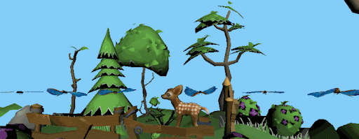
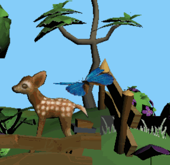
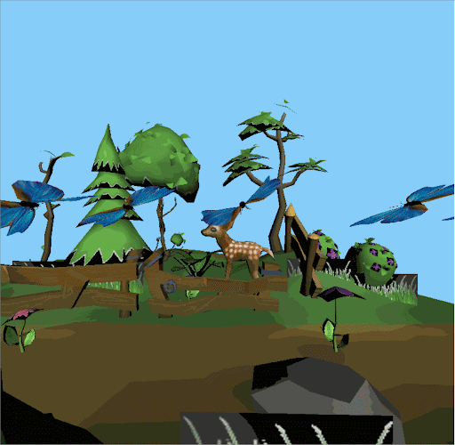

Realistic Butterfly Flight and Behavior Simulation with WebGPU
==================================
### University of Pennsylvania, CIS 565: GPU Programming and Architecture, Final Project
#### Author:   
* [Jiajun Li](https://www.linkedin.com/in/jiajun-li-5063a4217/) 
* [Haoquan Liang](https://www.linkedin.com/in/leohaoquanliang/)
* [Shineng Tang](https://www.linkedin.com/in/shineng-t-224192195/)

## **Overview**

Our project aims to create a simulation of butterflies and control their behaviors using WebGPU. We created a hierarchical rigged skeleton for the butterfy, animated the butterflies by using the bones, and used instancing to increase the performance so that it can run in realtime.    
   

## Table of Contents  
* [Features](#features) 
* [Presentations](#presentation)
* [Reference](#reference)

## <a name="presentation">Presentations</a>
* [**Final Presentation - 12/12/22**](https://docs.google.com/presentation/d/17RwpunRFOpwLk0Y-TTjAFLTOdtHMy-Pt/edit?usp=sharing&ouid=108273071647581215041&rtpof=true&sd=true)
* [Milestone 3 - 12/05/22](https://docs.google.com/presentation/d/1AHIefwlu55ZyYZG1VEadliJOUGMHE7-N/edit#slide=id.g19cb66c9ca1_0_15)
* [Milestone 2 - 11/28/22](https://docs.google.com/presentation/d/1AHIefwlu55ZyYZG1VEadliJOUGMHE7-N/edit?rtpof=true)
* [Milestone 1 - 11/16/22](https://docs.google.com/presentation/d/1D0KU-Wp5UGeHj1HUCtebzcEjDT0gydEKm9OTPFgEmzs/edit#slide=id.g18fde25b9ae_9_0)
* [Pitch - 11/6/22](https://docs.google.com/presentation/d/1jvJxEsBRErgb7ftC49tvywUgjpmYqgujXNGTN85En-0/edit?usp=sharing)

## <a name="features">Features</a>
- **WebGPU Compute and Rendering Pipeline with instancing rendering**
  - Compute shaders compute the new joint transformations
  - Instancing rendering ensures minimum memory consumption and maximum rendering performance   
       
- **glTF loader with texture, material loading and PBR shading**
  - Loading glTF files with skeleton information and PBR-based materials
  - Support loading multiple glTF meshes.   
     
- **Hierachy skeleton loader and mesh deformer by using the skeleton**
  - We rigged the butterfly mesh with Blender and successfully use our pipeline and the skeleton to deform the mesh.
  - Joint hierachy is correctly maintained and used in computation   
     
- **Butterfly simulations**
  - Currently we have simple procedurally generated path and simple forces like gravity and wind for the butterfly
  - We will add realistic flight simulation to the butterflies based on this [paper](http://www.cad.zju.edu.cn/home/jin/tog2022/tog2022.pdf)    
     
- **Simulation and bahavior control GUI**
  - Allow the users to change key parameters in the simulation, such as the number of butterflies, the magnitude of different forces, and the current behaviors being simulated.    
       

## <a name="reference"> Reference </a>
* [A Practical Model for Realistic Butterfly Flight Simulation](http://www.cad.zju.edu.cn/home/jin/tog2022/tog2022.pdf)
* [Efficiently rendering glTF models - A WebGPU Case Study](https://toji.github.io/webgpu-gltf-case-study/)
* [WebGPU Samples](https://austin-eng.com/webgpu-samples)
